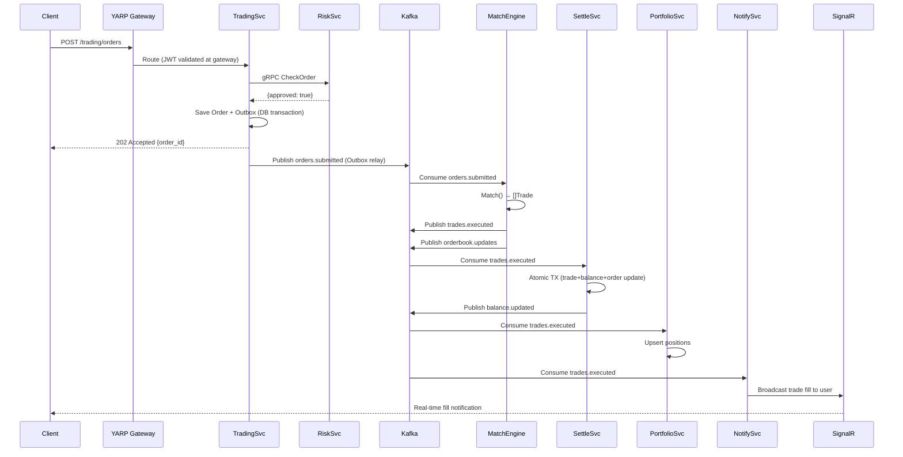

# NexTrade — Production-Grade Distributed Trading Platform
## Complete Architecture Blueprint & Project Handbook

> **Based on reverse-engineering EngineX (Go) → Redesigned in .NET 8**
> 
> Version 1.0 | June 2026 | This document is the single source of truth.
> If development pauses for months, resume from here alone.

---

# TABLE OF CONTENTS

1. [Phase 1 — EngineX Full Analysis](#phase-1--enginex-full-analysis)
2. [Phase 2 — NexTrade System Design](#phase-2--nextrade-system-design)
3. [Phase 3 — Microservice Design](#phase-3--microservice-design)
4. [Phase 4 — Database Design](#phase-4--database-design)
5. [Phase 5 — CQRS + MediatR Design](#phase-5--cqrs--mediatr-design)
6. [Phase 6 — Kafka Architecture](#phase-6--kafka-architecture)
7. [Phase 7 — gRPC Design](#phase-7--grpc-design)
8. [Phase 8 — GraphQL Gateway](#phase-8--graphql-gateway)
9. [Phase 9 — Matching Engine Design](#phase-9--matching-engine-design)
10. [Phase 10 — Security Design](#phase-10--security-design)
11. [Phase 11 — Observability](#phase-11--observability)
12. [Phase 12 — Implementation Roadmap](#phase-12--implementation-roadmap)
13. [Phase 13 — Project Handbook](#phase-13--project-handbook)

---

# PHASE 1 — ENGINEX FULL ANALYSIS

## 1.1 Business Problem Solved

EngineX is a **real-time limit/market order matching engine** that simulates a stock exchange backend. It solves the core infrastructure challenge of a trading platform: accepting user orders, validating risk, matching them against opposing orders using price-time priority, and settling the resulting trades (updating balances and positions atomically). The system prioritizes low-latency order processing, durable message delivery, and correct financial accounting.

**Real-world use cases:**
- Stock exchange order matching (NSE/BSE-style)
- Crypto exchange engine (Binance/WazirX-style)
- Internal dark pool for institutional trading
- Educational simulation of exchange infrastructure

---

## 1.2 EngineX Architecture Overview

EngineX is written in **Go 1.25** and comprises **6 microservices**:

| Service | Role |
|---|---|
| Gateway | HTTP REST ingress, auth delegation, risk check, Kafka publish |
| AuthSvc | JWT issuance and validation over gRPC |
| RiskSvc | Pre-trade risk: balance check, order size, dedup via gRPC |
| Engine | In-memory matching engine consuming from Kafka |
| Executor | Settlement service consuming matched trades from Kafka |
| WsHub | WebSocket server for real-time order book depth pushes |

**Infrastructure:** PostgreSQL 16, Redis 7, Kafka 3.7 (KRaft mode), Docker Compose.

---

## 1.3 Complete Order Lifecycle

```
Client
  │
  ▼
POST /api/v1/orders  (Gateway HTTP)
  │
  ├─→ Validate request body (Gin binding)
  ├─→ Extract userID from JWT (middleware)
  ├─→ gRPC → RiskSvc.CheckOrder()
  │     ├── order size check (value < ₹10L)
  │     ├── balance check  (Redis → Postgres fallback)
  │     └── dedup check    (Redis "order:seen" key)
  ├─→ INSERT order to Postgres (status=OPEN)
  ├─→ Serialize to Protobuf
  └─→ Publish to Kafka topic: orders.submitted (key=symbol)

Kafka: orders.submitted
  │
  ▼
Engine (consumer group: engine-group)
  │
  ├─→ Deserialize Protobuf → internal Order struct
  ├─→ getOrCreateBook(symbol)  [sync.RWMutex]
  ├─→ book.Match(order)
  │     ├── hasSelfMatch() check
  │     ├── matchBuy() / matchSell()  [B-tree walk]
  │     ├── fillFromLevel()  [FIFO within price level]
  │     └── rest unfilled LIMIT on book
  ├─→ Publish each Trade → Kafka: trades.executed
  └─→ Publish DepthSnapshot → Kafka: orderbook.updates

Kafka: trades.executed
  │
  ▼
Executor (consumer group: executor-group)
  │
  ├─→ Deserialize JSON Trade
  ├─→ Validate trade fields
  ├─→ Verify buy & sell orders exist in DB
  ├─→ Redis idempotency check (trade:processed:ID)
  ├─→ Postgres transaction:
  │     ├── INSERT trade record
  │     ├── DEBIT buyer cash balance
  │     ├── CREDIT seller cash balance
  │     └── UPDATE order statuses → FILLED
  └─→ Mark trade processed in Redis

Kafka: orderbook.updates
  │
  ▼
WsHub (consumer group: wshub-group)
  │
  ├─→ Deserialize DepthSnapshot
  ├─→ Wrap in DepthMessage{type: "depth"}
  └─→ Broadcast to all WebSocket clients for symbol
```

---

## 1.4 Matching Engine — Core Design

**Data structure:** Google B-tree (`btree.BTreeG[*PriceLevel]`, degree=32)
- Bids tree: descending comparator (highest price = best bid at top)
- Asks tree: ascending comparator (lowest price = best ask at top)
- Orders map: `map[string]*Order` for O(1) cancel lookup

**PriceLevel:** holds a FIFO slice of `*Order`. Front() is matched first (time priority). RemoveFront() after fill. The combination of B-tree + FIFO slice implements **Price-Time Priority** correctly.

**Matching algorithm (matchBuy):**
1. Peek best ask (first element of ascending tree)
2. If ask.Price > buy.Price → no match → stop
3. fillFromLevel(incoming, bestAsk): fill FIFO until qty exhausted or level empty
4. Remove empty price levels. Loop.
5. Unfilled remainder rests on book (LIMIT only).

**Self-Match Prevention:** dual-layer — `hasSelfMatch()` at entry (scans tree for same UserID at same price) and inside `fillFromLevel()` (breaks if `resting.UserID == incoming.UserID`).

**Prices:** `int64` scaled integers (₹1500.50 → `150050`). Avoids IEEE 754 floating point comparison bugs.

---

## 1.5 gRPC Contracts

**auth.proto:**
- `ValidateToken(token) → {valid, user_id, email}`
- `Register(email, password, full_name) → {user_id, email}`
- `Login(email, password) → {access_token, refresh_token}`

**risk.proto:**
- `CheckOrder(user_id, order_id, symbol, side, price, quantity) → {approved, reject_reason}`

**order.proto:** Kafka serialization contract (not a service):
- `OrderMessage{order_id, user_id, symbol, side, type, price, quantity, created_at}`

---

## 1.6 Kafka Topics

| Topic | Producer | Consumer | Content |
|---|---|---|---|
| `orders.submitted` | Gateway | Engine | Protobuf OrderMessage |
| `trades.executed` | Engine | Executor | JSON Trade |
| `orderbook.updates` | Engine | WsHub | JSON DepthSnapshot |

6 partitions, replication_factor=1 (dev), retention 168h.

---

## 1.7 EngineX Strengths

- Correct price-time priority matching with B-tree
- Self-match prevention at two levels
- Atomic settlement in a single Postgres transaction
- Redis-based idempotency for trade settlement (at-least-once safe)
- Protobuf for Kafka serialization (compact, typed)
- Clean separation: Engine is purely in-memory, Executor owns DB writes
- int64 price scaling avoids float comparison bugs
- Per-symbol book creation without pre-registration

---

## 1.8 EngineX Weaknesses & Bugs

### Critical / High

| # | Issue | Location | Impact |
|---|---|---|---|
| 1 | **Single global mutex** on Engine.books — all symbols contend on one lock | `engine.go:34` | Serializes all symbol processing; kills throughput at scale |
| 2 | **Engine is stateless** — no snapshot/replay on restart; all in-memory state lost | engine.go | Crash = empty order books; all resting orders vanish |
| 3 | **Snapshot bug**: `Snapshot()` uses `.Ascend()` for **both** Bids and Asks — Bids should use `.Descend()` | `orderbook.go` | Top-of-book bids served in wrong order to UI |
| 4 | **MARKET order bug**: `matchBuy()` breaks after first level — correct. But `matchSell()` same. However the loop-break means partial market fill is possible with no notification | matching.go | Silent partial fill on market orders |
| 5 | **No position check for SELL orders** — checker.go lines 51-55 are commented out | risk/checker.go | User can sell shares they don't own (naked short) |
| 6 | **Balance not locked at order submission** — only checked, not reserved | risk/checker.go | Race: two concurrent orders can both pass balance check but overdraw |
| 7 | **No Outbox pattern** — Kafka publish failure after DB write leaves order stuck | gateway/handler.go | Order in DB but never reaches engine |
| 8 | **Cache not invalidated** after settlement | settlement/executor.go | Redis shows stale balance; next risk check approves over-limit orders |

### Medium

| # | Issue | Impact |
|---|---|---|
| 9 | Auth middleware calls gRPC `ValidateToken` on every request — no caching | ~5ms latency per request; auth bottleneck |
| 10 | GetOrderBook returns empty placeholder | Feature non-functional |
| 11 | Hardcoded JWT secret fallback in config | Security risk in production |
| 12 | Insecure gRPC connections (no TLS) between services | MitM possible |
| 13 | No dead-letter queue — bad Kafka messages silently committed | Data loss |
| 14 | Partition key strategy: Gateway publishes with `symbol` as key (correct) but Executor uses offset commit regardless of processing result | Out-of-order settlement possible |
| 15 | No rate limiting on HTTP API | DoS vulnerability |
| 16 | No graceful shutdown on AuthSvc | In-flight requests dropped on deploy |

### Architecture Limitations

- **Single-instance Engine required** — partitioned by symbol but single process; no horizontal scale
- **No replay capability** — cannot replay Kafka to rebuild order books after failure  
- **No portfolio/position service** — positions updated in settlement but no dedicated read model
- **No notification system** — users have no way to know their order was filled except WebSocket (no email, no push)
- **No order cancellation API** — cancel logic exists in OrderBook but no HTTP endpoint exposes it
- **WS Hub has no auth** — any client can subscribe to any symbol depth feed
- **No GraphQL** — no aggregated read API for portfolio + orders + market data in one query
- **No observability** — Prometheus/OpenTelemetry stubs exist in `pkg/` but not wired to services

---

# PHASE 2 — NEXTRADE SYSTEM DESIGN

## 2.1 Technology Stack

| Layer | Technology |
|---|---|
| Runtime | .NET 8, C# 12 |
| Web API | ASP.NET Core 8 |
| ORM | Entity Framework Core 8 |
| Database | SQL Server 2022 |
| Cache | Redis 7 (StackExchange.Redis) |
| Message Bus | Apache Kafka (Confluent.Kafka) |
| Service Mesh | Istio + mTLS |
| API Gateway | YARP (Reverse Proxy) |
| GraphQL | Hot Chocolate 14 |
| gRPC | Grpc.AspNetCore |
| Real-time | SignalR |
| CQRS | MediatR 12 |
| Validation | FluentValidation |
| Mapping | Mapster |
| Logging | Serilog + Seq |
| Tracing | OpenTelemetry + Jaeger |
| Metrics | Prometheus + Grafana |
| Serialization | Protobuf (Google.Protobuf) |
| Containerization | Docker + Kubernetes (AKS) |
| Resilience | Polly |

**Architecture styles:** Microservices, Event-Driven Architecture, Domain-Driven Design, Clean Architecture, CQRS, Vertical Slice Architecture (within services).

---

## 2.2 High-Level Architecture Diagram

```
┌─────────────────────────────────────────────────────────────────┐
│                         EXTERNAL CLIENTS                        │
│          Web App       Mobile App      Third-Party API          │
└───────────────────┬─────────────┬──────────────┬───────────────┘
                    │             │              │
                    ▼             ▼              ▼
         ┌──────────────────────────────────────────┐
         │           YARP API GATEWAY               │
         │   TLS Termination │ Rate Limiting        │
         │   JWT Validation  │ Request Routing      │
         └──────┬──────┬──────┬──────┬──────┬───────┘
                │      │      │      │      │
    ┌───────────┘  ┌───┘  ┌───┘  ┌───┘  ┌──┘
    │              │      │      │      │
    ▼              ▼      ▼      ▼      ▼
 AuthSvc    TradingSvc  MatchingEngine  PortfolioSvc  MarketDataSvc
    │              │         │              │              │
    └──────┬───────┘         │              └──────┬───────┘
           │                 │                     │
    ┌──────▼─────────────────▼─────────────────────▼──────┐
    │                    KAFKA CLUSTER                      │
    │  orders.submitted │ trades.executed │ market.data   │
    │  orders.cancelled │ balance.updated │ orderbook.snap│
    └──────┬────────────────────────┬────────────────────-┘
           │                        │
    ┌──────▼──────┐         ┌───────▼───────┐
    │ SettleSvc   │         │ NotifySvc     │
    └─────────────┘         └───────────────┘
           │
    ┌──────▼──────────────────────────────────────────────┐
    │              GraphQL Gateway (Hot Chocolate)         │
    │   Aggregates: Auth + Trading + Portfolio + Market    │
    └─────────────────────────────────────────────────────┘
                    │ SignalR Hub
                    ▼
           Real-time WebSocket clients
```

---

## 2.3 Context Diagram (C4 Level 1)

```
┌──────────────────────────────────────────────────────────────┐
│                         NexTrade System                       │
│                                                              │
│   ┌──────────┐   ┌──────────┐   ┌──────────┐               │
│   │  Auth    │   │ Trading  │   │ Matching │               │
│   │ Service  │   │ Service  │   │  Engine  │               │
│   └──────────┘   └──────────┘   └──────────┘               │
│   ┌──────────┐   ┌──────────┐   ┌──────────┐               │
│   │Settlement│   │Portfolio │   │  Market  │               │
│   │ Service  │   │ Service  │   │   Data   │               │
│   └──────────┘   └──────────┘   └──────────┘               │
│   ┌──────────┐   ┌──────────┐                              │
│   │ Notify   │   │ GraphQL  │                              │
│   │ Service  │   │ Gateway  │                              │
│   └──────────┘   └──────────┘                              │
└──────────────────────────────────────────────────────────────┘
         │               │                  │
    Retail Trader    Market Maker      Admin Dashboard
```

---

## 2.4 Container Diagram (C4 Level 2)

```
YARP Gateway (ASP.NET Core 8)
  ├── Routes /auth/*         → Auth Service :5001
  ├── Routes /trading/*      → Trading Service :5002
  ├── Routes /portfolio/*    → Portfolio Service :5003
  ├── Routes /market/*       → Market Data Service :5004
  └── Routes /graphql        → GraphQL Gateway :5010

Auth Service (:5001)
  ├── HTTP API (register, login, refresh, revoke)
  ├── gRPC Server (ValidateToken, GetUser)
  └── SQL Server: auth_db

Trading Service (:5002)
  ├── HTTP API (submit order, cancel order, get orders)
  ├── Kafka Producer: orders.submitted, orders.cancelled
  └── SQL Server: trading_db (Orders, Outbox)

Matching Engine (:5003 — internal only)
  ├── Kafka Consumer: orders.submitted, orders.cancelled
  ├── Kafka Producer: trades.executed, orderbook.updates
  ├── In-Memory Order Books (partitioned by symbol)
  └── Redis: Snapshot storage for recovery

Settlement Service (:5004 — internal only)
  ├── Kafka Consumer: trades.executed
  ├── SQL Server: settlement_db (Trades, Balances, Outbox)
  └── Kafka Producer: balance.updated

Portfolio Service (:5005)
  ├── HTTP API (positions, P&L, portfolio summary)
  ├── Kafka Consumer: trades.executed, balance.updated
  └── SQL Server: portfolio_db (Positions, Portfolio)

Market Data Service (:5006)
  ├── HTTP API (OHLCV, tickers, symbols)
  ├── Kafka Consumer: trades.executed, orderbook.updates
  └── Redis: tick data, order book depth cache

Notification Service (:5007 — internal only)
  ├── Kafka Consumer: trades.executed, orders.*, balance.updated
  ├── SignalR Hub: real-time push to clients
  └── SQL Server: notification_db (Notifications, Preferences)

GraphQL Gateway (:5010)
  ├── Hot Chocolate Federation
  ├── gRPC calls to all services
  └── DataLoader for N+1 prevention
```

---

## 2.5 Event Flow Diagram



---

# PHASE 3 — MICROSERVICE DESIGN

## 3.1 Auth Service

**Purpose:** Identity and access management. Issues JWTs, validates tokens for all other services.

**Responsibilities:**
- User registration with bcrypt password hashing
- Login → issue short-lived access token (15 min) + long-lived refresh token (7 days)
- Token refresh without re-login
- Token revocation (refresh token blacklist in Redis)
- gRPC endpoint for internal token validation (called by YARP or other services)
- RBAC: roles `TRADER`, `MARKET_MAKER`, `ADMIN`

**Bounded Context:** Identity. Owns `Users`, `RefreshTokens`.

**Database:** `auth_db` — SQL Server

**Public API (HTTP):**
- `POST /auth/register` — {email, password, fullName} → {userId, email}
- `POST /auth/login` — {email, password} → {accessToken, refreshToken}
- `POST /auth/refresh` — {refreshToken} → {accessToken, refreshToken}
- `POST /auth/revoke` — {refreshToken} → 204
- `GET /auth/me` — [JWT] → {userId, email, roles}

**gRPC API:**
- `ValidateToken(token) → {valid, userId, email, roles}`
- `GetUser(userId) → {userId, email, fullName, roles, createdAt}`

**Kafka:** None (Auth is synchronous only)

**Commands:** `RegisterUserCommand`, `LoginCommand`, `RefreshTokenCommand`, `RevokeTokenCommand`

**Queries:** `GetCurrentUserQuery`, `ValidateTokenQuery`

**Domain Events:** `UserRegisteredEvent` (published internally for audit)

**Scaling:** Stateless — horizontal scale freely. Token validation cached in Redis (JWT blacklist only).

**Failure Scenarios:**
- DB down → 503 on login/register; existing valid JWTs still work
- Redis down → token revocation unavailable; refresh still works

**Security:** bcrypt cost factor 12. JWT signed with RS256 (asymmetric). Private key in Azure Key Vault / K8s Secret. Public key distributed to services for local validation (no gRPC call per request).

**Folder Structure:**
```
AuthService/
├── src/
│   ├── AuthService.API/          ← ASP.NET Core entry point
│   ├── AuthService.Application/  ← Commands, Queries, Handlers
│   ├── AuthService.Domain/       ← User entity, domain events
│   ├── AuthService.Infrastructure/ ← EF Core, JWT, Redis
│   └── AuthService.Contracts/    ← gRPC proto, shared DTOs
└── tests/
    ├── AuthService.UnitTests/
    └── AuthService.IntegrationTests/
```

---

## 3.2 Trading Service

**Purpose:** Order lifecycle management. Accepts orders from clients, validates, persists, and dispatches to Kafka via Outbox pattern.

**Responsibilities:**
- Accept and validate order submissions (FluentValidation)
- Pre-trade risk gRPC call to Risk Service
- Persist order with Outbox entry in single DB transaction
- Outbox relay to Kafka (background worker)
- Accept order cancellations
- Serve order history and status queries

**Bounded Context:** Trading. Owns `Orders`, `Outbox`.

**Database:** `trading_db`

**Public API (HTTP):**
- `POST /trading/orders` — submit order
- `DELETE /trading/orders/{orderId}` — cancel order
- `GET /trading/orders` — list user's orders (paginated)
- `GET /trading/orders/{orderId}` — single order detail

**gRPC API (client to Risk Service):**
- `CheckOrder(...)` → approval

**Kafka (producer via Outbox):**
- `orders.submitted` — on new order
- `orders.cancelled` — on cancellation

**Commands:** `SubmitOrderCommand`, `CancelOrderCommand`

**Queries:** `GetOrdersQuery`, `GetOrderByIdQuery`

**Domain Events:** `OrderSubmittedEvent`, `OrderCancelledEvent`

**Idempotency:** `idempotency_key` (client-provided UUID) stored in DB. Duplicate submission returns existing order.

**Outbox Pattern:** `OrderOutbox` table. Separate `OutboxRelayWorker` (IHostedService) polls table every 100ms and publishes to Kafka. Marks rows `Published=true` on success. This guarantees exactly-once delivery from trading service perspective.

**Scaling:** Horizontal. Outbox relay uses distributed lock (Redis SETNX) to prevent duplicate publishing across replicas.

---

## 3.3 Matching Engine Service

**Purpose:** Pure in-memory order matching. The most performance-critical service. Consumes orders from Kafka, produces trades.

**Responsibilities:**
- Maintain one `OrderBook` per symbol in memory
- Execute price-time priority matching (Limit + Market orders)
- Self-match prevention
- Publish executed trades to Kafka
- Publish order book depth snapshots to Kafka
- Periodic snapshot to Redis (every 500ms) for crash recovery
- Replay from Redis snapshot + Kafka on startup

**Bounded Context:** Matching. Owns no DB (Redis only for snapshots).

**gRPC API:** None (purely Kafka-driven)

**Kafka (consumer):**
- `orders.submitted` (consumer group: `matching-engine`)
- `orders.cancelled` (consumer group: `matching-engine`)

**Kafka (producer):**
- `trades.executed`
- `orderbook.updates`

**Data Structures:** SortedDictionary<long, PriceLevel> (or custom red-black tree). See Phase 9 for full design.

**Scaling Strategy:** Partition by symbol. Each Kafka partition handles a set of symbols. One Engine instance per partition. Horizontal scale = add partitions + Engine replicas. Never share a symbol across instances.

**Failure Recovery:** On startup, load last snapshot from Redis for each symbol, then replay unprocessed Kafka messages from snapshot offset.

**Thread Safety:** Single-threaded per symbol. One `Channel<OrderMessage>` per symbol. Worker goroutine processes channel sequentially. No locking needed within a symbol's processing loop.

---

## 3.4 Settlement Service

**Purpose:** Atomic financial settlement of executed trades. Updates balances and positions.

**Responsibilities:**
- Consume trades from Kafka
- Idempotent processing (Redis dedup by trade ID)
- Atomic DB transaction: insert trade, debit buyer, credit seller, update order statuses
- Invalidate Redis balance cache after settlement
- Publish `balance.updated` event

**Bounded Context:** Settlement. Owns `Trades`, `Balances`.

**Database:** `settlement_db`

**Kafka (consumer):** `trades.executed`

**Kafka (producer via Outbox):** `balance.updated`

**Commands:** `SettleTradeCommand`

**Failure Scenarios:**
- If DB commit succeeds but Kafka publish fails → Outbox pattern catches it
- If Redis mark-processed fails → trade re-processed on next startup → idempotency check in DB prevents double-settle (UNIQUE constraint on trade_id)

---

## 3.5 Portfolio Service

**Purpose:** Read model for user portfolio. Positions, P&L, holdings.

**Responsibilities:**
- Consume `trades.executed` and `balance.updated` events
- Maintain `Positions` per user per symbol (CQRS read side)
- Compute unrealized P&L (using current price from Market Data)
- Serve portfolio queries

**Bounded Context:** Portfolio. Owns `Positions`, `Portfolios`, `PortfolioSnapshots`.

**Public API (HTTP):**
- `GET /portfolio/positions` — all positions for current user
- `GET /portfolio/positions/{symbol}` — single position
- `GET /portfolio/summary` — total portfolio value, P&L
- `GET /portfolio/history` — daily P&L history

**Kafka (consumer):** `trades.executed`, `balance.updated`

**Queries:** `GetPositionsQuery`, `GetPortfolioSummaryQuery`

---

## 3.6 Market Data Service

**Purpose:** Real-time and historical market data. OHLCV, tickers, order book depth.

**Responsibilities:**
- Consume `trades.executed` → build tick data, compute OHLCV candles
- Consume `orderbook.updates` → cache current depth in Redis
- Serve historical OHLCV queries
- Serve real-time ticker (last price, 24h change, volume)

**Public API (HTTP):**
- `GET /market/symbols` — list tradeable symbols
- `GET /market/ticker/{symbol}` — real-time ticker
- `GET /market/depth/{symbol}` — order book depth (top N levels)
- `GET /market/ohlcv/{symbol}?interval=1m&from=&to=` — OHLCV data

**Kafka (consumer):** `trades.executed`, `orderbook.updates`

---

## 3.7 Notification Service

**Purpose:** Real-time and push notifications to users about their orders and trades.

**Responsibilities:**
- Consume events: `trades.executed`, `orders.submitted`, `orders.cancelled`, `balance.updated`
- Push real-time notifications via SignalR to authenticated WebSocket clients
- Store notification history in DB
- Support notification preferences (email, push, in-app)

**SignalR Hub:** `/hubs/notifications`
- User-specific channels (connectionId → userId mapping)
- Events pushed: `OrderFilled`, `OrderCancelled`, `BalanceUpdated`

**Kafka (consumer):** `trades.executed`, `orders.*`, `balance.updated`

---

## 3.8 GraphQL Gateway

**Purpose:** Unified read API aggregating data from all services. Used by the web app for dashboard, portfolio, order history queries.

**Technology:** Hot Chocolate 14 with schema federation.

**Queries, Mutations, Subscriptions:** See Phase 8.

---

# PHASE 4 — DATABASE DESIGN

## 4.1 Auth Service Database (auth_db)

```sql
-- Users
CREATE TABLE Users (
    Id              UNIQUEIDENTIFIER    NOT NULL DEFAULT NEWSEQUENTIALID() PRIMARY KEY,
    Email           NVARCHAR(256)       NOT NULL,
    PasswordHash    NVARCHAR(512)       NOT NULL,
    FullName        NVARCHAR(200)       NOT NULL,
    Role            NVARCHAR(50)        NOT NULL DEFAULT 'TRADER',
    IsActive        BIT                 NOT NULL DEFAULT 1,
    CreatedAt       DATETIME2(7)        NOT NULL DEFAULT GETUTCDATE(),
    UpdatedAt       DATETIME2(7)        NOT NULL DEFAULT GETUTCDATE(),
    RowVersion      ROWVERSION          NOT NULL,  -- optimistic concurrency
    CONSTRAINT UQ_Users_Email UNIQUE (Email)
);
CREATE INDEX IX_Users_Email ON Users(Email);

-- RefreshTokens
CREATE TABLE RefreshTokens (
    Id              UNIQUEIDENTIFIER    NOT NULL DEFAULT NEWSEQUENTIALID() PRIMARY KEY,
    UserId          UNIQUEIDENTIFIER    NOT NULL REFERENCES Users(Id),
    Token           NVARCHAR(512)       NOT NULL,
    ExpiresAt       DATETIME2(7)        NOT NULL,
    IsRevoked       BIT                 NOT NULL DEFAULT 0,
    RevokedAt       DATETIME2(7)        NULL,
    CreatedAt       DATETIME2(7)        NOT NULL DEFAULT GETUTCDATE(),
    CONSTRAINT UQ_RefreshTokens_Token UNIQUE (Token)
);
CREATE INDEX IX_RefreshTokens_UserId ON RefreshTokens(UserId);
CREATE INDEX IX_RefreshTokens_Token ON RefreshTokens(Token);
```

---

## 4.2 Trading Service Database (trading_db)

```sql
-- Orders
CREATE TABLE Orders (
    Id                  UNIQUEIDENTIFIER    NOT NULL DEFAULT NEWSEQUENTIALID() PRIMARY KEY,
    UserId              UNIQUEIDENTIFIER    NOT NULL,
    Symbol              NVARCHAR(20)        NOT NULL,
    Side                NVARCHAR(10)        NOT NULL,  -- BUY | SELL
    Type                NVARCHAR(10)        NOT NULL,  -- LIMIT | MARKET
    Price               BIGINT              NOT NULL DEFAULT 0,  -- scaled int64
    Quantity            BIGINT              NOT NULL,
    FilledQuantity      BIGINT              NOT NULL DEFAULT 0,
    Status              NVARCHAR(20)        NOT NULL DEFAULT 'OPEN',
    IdempotencyKey      NVARCHAR(100)       NULL,
    SubmittedAt         DATETIME2(7)        NOT NULL DEFAULT GETUTCDATE(),
    UpdatedAt           DATETIME2(7)        NOT NULL DEFAULT GETUTCDATE(),
    RowVersion          ROWVERSION          NOT NULL,
    CONSTRAINT CK_Orders_Side CHECK (Side IN ('BUY','SELL')),
    CONSTRAINT CK_Orders_Type CHECK (Type IN ('LIMIT','MARKET')),
    CONSTRAINT CK_Orders_Status CHECK (Status IN ('OPEN','PARTIAL','FILLED','CANCELLED')),
    CONSTRAINT CK_Orders_Quantity CHECK (Quantity > 0),
    CONSTRAINT UQ_Orders_IdempotencyKey UNIQUE (IdempotencyKey)
);
CREATE INDEX IX_Orders_UserId ON Orders(UserId);
CREATE INDEX IX_Orders_Symbol_Status ON Orders(Symbol, Status);
CREATE INDEX IX_Orders_SubmittedAt ON Orders(SubmittedAt DESC);

-- Outbox (Transactional Outbox Pattern)
CREATE TABLE OrderOutbox (
    Id              UNIQUEIDENTIFIER    NOT NULL DEFAULT NEWSEQUENTIALID() PRIMARY KEY,
    OrderId         UNIQUEIDENTIFIER    NOT NULL REFERENCES Orders(Id),
    EventType       NVARCHAR(100)       NOT NULL,  -- 'OrderSubmitted' | 'OrderCancelled'
    Payload         NVARCHAR(MAX)       NOT NULL,  -- JSON or Base64 Protobuf
    CreatedAt       DATETIME2(7)        NOT NULL DEFAULT GETUTCDATE(),
    PublishedAt     DATETIME2(7)        NULL,
    IsPublished     BIT                 NOT NULL DEFAULT 0
);
CREATE INDEX IX_OrderOutbox_IsPublished_CreatedAt ON OrderOutbox(IsPublished, CreatedAt);
```

---

## 4.3 Settlement Service Database (settlement_db)

```sql
-- Balances
CREATE TABLE Balances (
    Id              UNIQUEIDENTIFIER    NOT NULL DEFAULT NEWSEQUENTIALID() PRIMARY KEY,
    UserId          UNIQUEIDENTIFIER    NOT NULL,
    Available       BIGINT              NOT NULL DEFAULT 0,   -- scaled int64 (paise)
    Locked          BIGINT              NOT NULL DEFAULT 0,   -- reserved for open orders
    UpdatedAt       DATETIME2(7)        NOT NULL DEFAULT GETUTCDATE(),
    RowVersion      ROWVERSION          NOT NULL,             -- optimistic concurrency for debit/credit
    CONSTRAINT UQ_Balances_UserId UNIQUE(UserId),
    CONSTRAINT CK_Balances_Available CHECK (Available >= 0),
    CONSTRAINT CK_Balances_Locked CHECK (Locked >= 0)
);

-- Trades (settlement record)
CREATE TABLE Trades (
    Id              UNIQUEIDENTIFIER    NOT NULL DEFAULT NEWSEQUENTIALID() PRIMARY KEY,
    BuyOrderId      UNIQUEIDENTIFIER    NOT NULL,
    SellOrderId     UNIQUEIDENTIFIER    NOT NULL,
    BuyerId         UNIQUEIDENTIFIER    NOT NULL,
    SellerId        UNIQUEIDENTIFIER    NOT NULL,
    Symbol          NVARCHAR(20)        NOT NULL,
    Price           BIGINT              NOT NULL,
    Quantity        BIGINT              NOT NULL,
    TradeValue      AS (Price * Quantity) PERSISTED,
    ExecutedAt      DATETIME2(7)        NOT NULL,
    SettledAt       DATETIME2(7)        NOT NULL DEFAULT GETUTCDATE(),
    CONSTRAINT UQ_Trades_BuyOrderId_SellOrderId UNIQUE(BuyOrderId, SellOrderId)
);
CREATE INDEX IX_Trades_BuyerId ON Trades(BuyerId);
CREATE INDEX IX_Trades_SellerId ON Trades(SellerId);
CREATE INDEX IX_Trades_Symbol_ExecutedAt ON Trades(Symbol, ExecutedAt DESC);

-- Outbox for settlement events
CREATE TABLE SettlementOutbox (
    Id              UNIQUEIDENTIFIER    NOT NULL DEFAULT NEWSEQUENTIALID() PRIMARY KEY,
    TradeId         UNIQUEIDENTIFIER    NOT NULL,
    EventType       NVARCHAR(100)       NOT NULL,
    Payload         NVARCHAR(MAX)       NOT NULL,
    CreatedAt       DATETIME2(7)        NOT NULL DEFAULT GETUTCDATE(),
    PublishedAt     DATETIME2(7)        NULL,
    IsPublished     BIT                 NOT NULL DEFAULT 0
);
```

---

## 4.4 Portfolio Service Database (portfolio_db)

```sql
-- Positions
CREATE TABLE Positions (
    Id              UNIQUEIDENTIFIER    NOT NULL DEFAULT NEWSEQUENTIALID() PRIMARY KEY,
    UserId          UNIQUEIDENTIFIER    NOT NULL,
    Symbol          NVARCHAR(20)        NOT NULL,
    Quantity        BIGINT              NOT NULL DEFAULT 0,
    AverageCost     BIGINT              NOT NULL DEFAULT 0,  -- scaled int64
    RealizedPnl     BIGINT              NOT NULL DEFAULT 0,
    UpdatedAt       DATETIME2(7)        NOT NULL DEFAULT GETUTCDATE(),
    RowVersion      ROWVERSION          NOT NULL,
    CONSTRAINT UQ_Positions_User_Symbol UNIQUE(UserId, Symbol)
);
CREATE INDEX IX_Positions_UserId ON Positions(UserId);

-- Audit Log
CREATE TABLE AuditLog (
    Id              BIGINT              NOT NULL IDENTITY(1,1) PRIMARY KEY,
    EntityType      NVARCHAR(100)       NOT NULL,
    EntityId        NVARCHAR(100)       NOT NULL,
    Action          NVARCHAR(50)        NOT NULL,
    UserId          UNIQUEIDENTIFIER    NULL,
    OldValues       NVARCHAR(MAX)       NULL,
    NewValues       NVARCHAR(MAX)       NULL,
    OccurredAt      DATETIME2(7)        NOT NULL DEFAULT GETUTCDATE()
);
CREATE INDEX IX_AuditLog_EntityType_EntityId ON AuditLog(EntityType, EntityId);
CREATE INDEX IX_AuditLog_UserId ON AuditLog(UserId);
-- Partition by OccurredAt month for large volumes
```

---

## 4.5 Notification Service Database (notification_db)

```sql
CREATE TABLE Notifications (
    Id              UNIQUEIDENTIFIER    NOT NULL DEFAULT NEWSEQUENTIALID() PRIMARY KEY,
    UserId          UNIQUEIDENTIFIER    NOT NULL,
    Type            NVARCHAR(50)        NOT NULL,  -- 'ORDER_FILLED', 'BALANCE_UPDATED'
    Title           NVARCHAR(200)       NOT NULL,
    Body            NVARCHAR(1000)      NOT NULL,
    IsRead          BIT                 NOT NULL DEFAULT 0,
    CreatedAt       DATETIME2(7)        NOT NULL DEFAULT GETUTCDATE()
);
CREATE INDEX IX_Notifications_UserId_CreatedAt ON Notifications(UserId, CreatedAt DESC);
```

---

## 4.6 Concurrency Strategy

**Balances (most critical):** Use `RowVersion` (ETag) for optimistic concurrency. Retry loop on `DbUpdateConcurrencyException`. For high-throughput settlement, use `UPDATE Balances SET Available = Available - @amount WHERE UserId = @id AND Available >= @amount` — conditional update is atomic at SQL Server level.

**Order Status Updates:** Optimistic concurrency via RowVersion. Settlement service retries on conflict.

**Balance Locking at Order Submission:** When a BUY order is submitted, lock funds immediately in the same transaction:
```sql
UPDATE Balances 
SET Available = Available - @orderValue, 
    Locked = Locked + @orderValue
WHERE UserId = @userId AND Available >= @orderValue
```
Return rows affected. If 0 → insufficient balance → reject order.

---

# PHASE 5 — CQRS + MEDIATR DESIGN

## 5.1 CQRS Architecture Pattern

Each service follows this pattern:

```
HTTP Controller
    │
    ▼
MediatR.Send(Command/Query)
    │
    ├── Pipeline Behaviors (ordered):
    │   1. LoggingBehavior         — structured logging of all requests
    │   2. ValidationBehavior      — FluentValidation, throws on failure
    │   3. IdempotencyBehavior     — dedup commands by idempotency key
    │   4. TransactionBehavior     — wrap commands in DB transaction
    │   5. CachingBehavior         — return cached result for queries
    │   6. MetricsBehavior         — emit Prometheus counter/histogram
    │
    ▼
Command/Query Handler
    │
    ├── Commands → Domain → Events → EF Core → Outbox
    └── Queries  → EF Core / Redis  → return DTO
```

---

## 5.2 Trading Service CQRS Detail

### Commands

**SubmitOrderCommand**
```csharp
public record SubmitOrderCommand(
    Guid UserId,
    string Symbol,
    OrderSide Side,
    OrderType Type,
    long Price,       // scaled int64
    long Quantity,
    string? IdempotencyKey
) : ICommand<SubmitOrderResult>;

// Handler:
// 1. Check idempotency (existing order with same key → return it)
// 2. gRPC RiskService.CheckOrder()
// 3. Lock balance: UPDATE Balances SET Available -= orderValue, Locked += orderValue
// 4. INSERT Order + OrderOutbox in one EF Core transaction
// 5. Publish OrderSubmittedEvent (in-process, for audit)
// 6. Return order ID
```

**CancelOrderCommand**
```csharp
public record CancelOrderCommand(Guid OrderId, Guid UserId) : ICommand;
// Handler:
// 1. Load order, verify ownership
// 2. Check status is OPEN or PARTIAL
// 3. UPDATE Order.Status = CANCELLED
// 4. INSERT OrderOutbox (OrderCancelled event)
// 5. Release locked balance back to available
```

### Queries

**GetOrdersQuery**
```csharp
public record GetOrdersQuery(
    Guid UserId,
    string? Symbol,
    OrderStatus? Status,
    int Page,
    int PageSize
) : IQuery<PagedResult<OrderDto>>;
// Handler: EF Core with LINQ, paginated, no cache (user-specific)
```

**GetOrderByIdQuery**
```csharp
public record GetOrderByIdQuery(Guid OrderId, Guid UserId) : IQuery<OrderDto?>;
// Cache: Redis with 30-second TTL, key: "order:{orderId}"
```

### Validators

```csharp
public class SubmitOrderCommandValidator : AbstractValidator<SubmitOrderCommand>
{
    public SubmitOrderCommandValidator()
    {
        RuleFor(x => x.Symbol).NotEmpty().MaximumLength(20).Matches("^[A-Z]+$");
        RuleFor(x => x.Quantity).GreaterThan(0).LessThanOrEqualTo(1_000_000);
        RuleFor(x => x.Price)
            .GreaterThan(0).When(x => x.Type == OrderType.Limit)
            .WithMessage("Price required for LIMIT orders");
        RuleFor(x => x.Side).IsInEnum();
        RuleFor(x => x.Type).IsInEnum();
    }
}
```

### Domain Events vs Integration Events

**Domain Event** (in-process, MediatR): `OrderSubmittedDomainEvent` — triggers side effects within the same bounded context (e.g., audit logging).

**Integration Event** (cross-service, Kafka via Outbox): `OrderSubmittedIntegrationEvent` — serialized to Outbox, relayed to Kafka by background worker.

### Pipeline Behaviors

```csharp
// ValidationBehavior
public class ValidationBehavior<TRequest, TResponse> : IPipelineBehavior<TRequest, TResponse>
{
    public async Task<TResponse> Handle(TRequest request, RequestHandlerDelegate<TResponse> next, ...)
    {
        var failures = _validators
            .Select(v => v.Validate(request))
            .SelectMany(r => r.Errors)
            .Where(f => f != null)
            .ToList();
        if (failures.Any()) throw new ValidationException(failures);
        return await next();
    }
}

// IdempotencyBehavior — checks if ICommand has IIdempotent interface
// TransactionBehavior — wraps ICommand in EF Core transaction
// CachingBehavior — checks IQuery<T> for [Cached] attribute
```

---

## 5.3 Caching Strategy

| Query | Cache | TTL | Invalidation |
|---|---|---|---|
| `GetOrderByIdQuery` | Redis | 30s | On status update |
| `GetPortfolioSummaryQuery` | Redis | 10s | On `balance.updated` event |
| `GetMarketDepthQuery` | Redis | 100ms | On `orderbook.updates` event |
| `GetTickerQuery` | Redis | 1s | On `trades.executed` event |
| `GetOHLCVQuery` | Redis | 60s | Time-based |

---

# PHASE 6 — KAFKA ARCHITECTURE

## 6.1 Topic Design

| Topic | Partitions | Replication | Retention | Key | Producer | Consumer(s) |
|---|---|---|---|---|---|---|
| `orders.submitted` | 12 | 3 | 7 days | symbol | TradingSvc (Outbox) | MatchingEngine |
| `orders.cancelled` | 12 | 3 | 7 days | symbol | TradingSvc (Outbox) | MatchingEngine |
| `trades.executed` | 12 | 3 | 30 days | symbol | MatchingEngine | SettleSvc, PortfolioSvc, MarketDataSvc, NotifySvc |
| `orderbook.updates` | 12 | 3 | 1 hour | symbol | MatchingEngine | MarketDataSvc, NotifySvc |
| `balance.updated` | 6 | 3 | 7 days | userId | SettleSvc (Outbox) | PortfolioSvc, NotifySvc |
| `orders.dlq` | 3 | 3 | 30 days | - | Consumers | Ops team |
| `trades.dlq` | 3 | 3 | 30 days | - | Consumers | Ops team |

**Partitioning rationale:** `orders.submitted` and `trades.executed` partitioned by symbol guarantees all messages for a symbol go to the same partition → same MatchingEngine instance processes them in order. `balance.updated` by userId ensures sequential balance updates per user.

---

## 6.2 Consumer Groups

| Consumer Group | Service | Topic(s) | Parallelism |
|---|---|---|---|
| `matching-engine` | MatchingEngine | orders.submitted, orders.cancelled | 1 instance per partition |
| `settlement-executor` | SettleSvc | trades.executed | 1 instance per partition |
| `portfolio-projector` | PortfolioSvc | trades.executed, balance.updated | Multiple replicas |
| `market-data-aggregator` | MarketDataSvc | trades.executed, orderbook.updates | Multiple replicas |
| `notification-router` | NotifySvc | trades.executed, orders.*, balance.updated | Multiple replicas |

---

## 6.3 Dead Letter Queue Strategy

```
Successful processing → CommitOffset()
Transient failure (DB timeout) → Retry 3x with exponential backoff → Retry topic
Permanent failure (bad schema) → DLQ topic + alert
```

**Retry Topics:**
- `orders.submitted.retry.1` (5s delay)
- `orders.submitted.retry.2` (30s delay)
- `orders.submitted.retry.3` (5min delay)
- After retry 3 → `orders.dlq`

**Dead Letter Queue:** Ops team consumes from DLQ, inspects, re-publishes or discards manually.

---

## 6.4 Message Contracts (Protobuf)

All Kafka messages use Protobuf for schema evolution safety.

```protobuf
// orders.proto
syntax = "proto3";

message OrderSubmittedEvent {
    string order_id         = 1;
    string user_id          = 2;
    string symbol           = 3;
    string side             = 4;   // BUY | SELL
    string type             = 5;   // LIMIT | MARKET
    int64  price            = 6;   // scaled
    int64  quantity         = 7;
    int64  submitted_at     = 8;   // Unix nanoseconds
    string idempotency_key  = 9;
}

message OrderCancelledEvent {
    string order_id     = 1;
    string user_id      = 2;
    string symbol       = 3;
    int64  cancelled_at = 4;
}

// trades.proto
message TradeExecutedEvent {
    string trade_id      = 1;
    string buy_order_id  = 2;
    string sell_order_id = 3;
    string buyer_id      = 4;
    string seller_id     = 5;
    string symbol        = 6;
    int64  price         = 7;
    int64  quantity      = 8;
    int64  executed_at   = 9;
}
```

**Schema Evolution Strategy:** Add new fields with new field numbers. Never remove or renumber. Use Confluent Schema Registry for schema validation at publish time.

---

## 6.5 Ordering Guarantees

**Within a partition:** Kafka guarantees order. Since symbol is the partition key, all orders for `INFY` always go to the same partition → matching engine sees them in submission order. This is critical for correct FIFO matching.

**Exactly-once vs At-least-once:**
- Kafka producers: `acks=all`, `enable.idempotence=true` → exactly-once at producer level
- Consumers: at-least-once consumption. Idempotency enforced at consumer level:
  - SettleSvc: Redis dedup + DB UNIQUE constraint on trade pair
  - PortfolioSvc: UPSERT semantics
  - NotifySvc: idempotency key per notification

---

# PHASE 7 — gRPC DESIGN

## 7.1 Proto Definitions

```protobuf
// auth_service.proto
syntax = "proto3";
package nextrade.auth.v1;

service AuthService {
    rpc ValidateToken   (ValidateTokenRequest)  returns (ValidateTokenResponse);
    rpc GetUser         (GetUserRequest)         returns (GetUserResponse);
}

message ValidateTokenRequest  { string token = 1; }
message ValidateTokenResponse {
    bool   valid   = 1;
    string user_id = 2;
    string email   = 3;
    repeated string roles = 4;
}
message GetUserRequest  { string user_id = 1; }
message GetUserResponse {
    string user_id    = 1;
    string email      = 2;
    string full_name  = 3;
    repeated string roles = 4;
    int64  created_at = 5;
}

// risk_service.proto
syntax = "proto3";
package nextrade.risk.v1;

service RiskService {
    rpc CheckOrder  (CheckOrderRequest) returns (CheckOrderResponse);
    rpc LockBalance (LockBalanceRequest) returns (LockBalanceResponse);
}

message CheckOrderRequest {
    string user_id  = 1;
    string order_id = 2;
    string symbol   = 3;
    string side     = 4;
    int64  price    = 5;
    int64  quantity = 6;
}
message CheckOrderResponse {
    bool   approved      = 1;
    string reject_reason = 2;
}
message LockBalanceRequest  { string user_id = 1; int64 amount = 2; }
message LockBalanceResponse { bool success = 1; int64 available_after = 2; }

// portfolio_service.proto
syntax = "proto3";
package nextrade.portfolio.v1;

service PortfolioService {
    rpc GetPosition      (GetPositionRequest)  returns (GetPositionResponse);
    rpc GetBalance       (GetBalanceRequest)   returns (GetBalanceResponse);
}
```

## 7.2 Service-to-Service Communication Matrix

| Caller | Callee | Method | Reason |
|---|---|---|---|
| YARP Gateway | AuthSvc | `ValidateToken` | Per-request JWT validation (with Redis cache) |
| TradingSvc | RiskSvc | `CheckOrder` | Synchronous pre-trade risk; cannot be async |
| TradingSvc | RiskSvc | `LockBalance` | Reserve funds at submission time |
| GraphQL GW | All services | Multiple | Aggregate queries |
| MatchingEngine | None | — | Purely Kafka-driven; no synchronous calls |

## 7.3 Versioning Strategy

Proto packages are versioned: `nextrade.auth.v1`. Breaking changes introduce `v2` alongside `v1`. Both served simultaneously until all callers migrated. Old version removed after grace period (2 sprints).

## 7.4 mTLS for gRPC

All gRPC connections use mTLS via Istio service mesh. Certificates auto-rotated by Istio. Application code uses `GrpcChannel` with `HttpClientHandler` pointing to service mesh endpoint — Istio sidecar handles TLS transparently.

---

# PHASE 8 — GRAPHQL GATEWAY

## 8.1 Schema Design (Hot Chocolate 14)

```graphql
type Query {
    # Auth
    me: User

    # Trading  
    orders(symbol: String, status: OrderStatus, page: Int, pageSize: Int): OrderConnection!
    order(id: ID!): Order

    # Portfolio
    portfolio: Portfolio!
    positions: [Position!]!
    position(symbol: String!): Position

    # Market Data
    ticker(symbol: String!): Ticker!
    tickers(symbols: [String!]!): [Ticker!]!
    orderBook(symbol: String!, depth: Int = 10): OrderBook!
    ohlcv(symbol: String!, interval: OHLCVInterval!, from: DateTime!, to: DateTime!): [OHLCV!]!
    symbols: [Symbol!]!
}

type Mutation {
    # Auth
    register(input: RegisterInput!): AuthResult!
    login(input: LoginInput!): AuthResult!
    refreshToken(token: String!): AuthResult!
    revokeToken(token: String!): Boolean!

    # Trading
    submitOrder(input: SubmitOrderInput!): SubmitOrderResult!
    cancelOrder(orderId: ID!): CancelOrderResult!
}

type Subscription {
    orderBookUpdated(symbol: String!): OrderBook!
    orderUpdated(orderId: ID): Order!
    tradeExecuted(symbol: String): Trade!
    portfolioUpdated: Portfolio!
}
```

## 8.2 Key Types

```graphql
type User {
    id: ID!
    email: String!
    fullName: String!
    roles: [String!]!
    createdAt: DateTime!
    portfolio: Portfolio  # resolved by PortfolioService
}

type Order {
    id: ID!
    symbol: String!
    side: OrderSide!
    type: OrderType!
    price: Long
    quantity: Long!
    filledQuantity: Long!
    remainingQuantity: Long!
    status: OrderStatus!
    submittedAt: DateTime!
    trades: [Trade!]!  # resolved by SettlementService
}

type Portfolio {
    totalValue: Long!
    availableBalance: Long!
    lockedBalance: Long!
    unrealizedPnl: Long!
    realizedPnl: Long!
    positions: [Position!]!
}
```

## 8.3 N+1 Prevention

Use DataLoader for every cross-service resolution:

```csharp
// When resolving Order.trades for a list of orders:
[DataLoader]
public class TradesByOrderIdDataLoader : BatchDataLoader<Guid, List<TradeDto>>
{
    protected override async Task<IReadOnlyDictionary<Guid, List<TradeDto>>> LoadBatchAsync(
        IReadOnlyList<Guid> orderIds, CancellationToken ct)
    {
        // Single gRPC call with all orderIds batched
        var trades = await _settlementClient.GetTradesByOrderIds(orderIds, ct);
        return trades.GroupBy(t => t.OrderId).ToDictionary(g => g.Key, g => g.ToList());
    }
}
```

## 8.4 Authorization Model

```csharp
[Authorize]               // requires valid JWT
[Authorize(Roles = "ADMIN")]  // role-based

// Field-level: user can only see their own orders
[UseFiltering]
public IQueryable<Order> GetOrders([Service] ITradingService svc, [GlobalState("userId")] Guid userId)
    => svc.GetOrdersQuery().Where(o => o.UserId == userId);
```

## 8.5 Subscriptions via SignalR

Hot Chocolate subscriptions are backed by a SignalR transport. Each subscription pushes events received from Kafka consumers through an in-process event bus (MediatR notifications) to subscribers.

---

# PHASE 9 — MATCHING ENGINE DESIGN

## 9.1 Order Book Data Structures

### Core Types

```csharp
public sealed class Order
{
    public Guid    Id        { get; }
    public Guid    UserId    { get; }
    public string  Symbol    { get; }
    public Side    Side      { get; }
    public OrderType Type    { get; }
    public long    Price     { get; }    // scaled int64 — 1500.50 → 150050
    public long    Quantity  { get; }
    public long    Filled    { get; private set; }
    public Status  Status    { get; private set; }
    public DateTime CreatedAt { get; }

    public long Remaining => Quantity - Filled;
    public bool IsFilled  => Filled >= Quantity;
}

public sealed class PriceLevel
{
    public long Price { get; }
    private readonly LinkedList<Order> _orders = new();  // FIFO queue

    public Order? Front => _orders.First?.Value;
    public void Enqueue(Order o) => _orders.AddLast(o);
    public void DequeueFront()   => _orders.RemoveFirst();
    public bool IsEmpty          => _orders.Count == 0;
    public long TotalQuantity    => _orders.Sum(o => o.Remaining);
}
```

### Why LinkedList over Array for PriceLevel?

`RemoveFront()` is O(1) on LinkedList vs O(n) for array shift. The front is removed constantly during matching. Trade-off: worse cache locality. For typical price levels (< 100 orders), the difference is negligible but O(1) is still preferred.

### Why SortedDictionary for the Book?

```csharp
public sealed class OrderBook
{
    private readonly SortedDictionary<long, PriceLevel> _bids;  // descending
    private readonly SortedDictionary<long, PriceLevel> _asks;  // ascending
    private readonly Dictionary<Guid, Order> _orderIndex;       // for cancel lookup

    public OrderBook(string symbol)
    {
        _bids = new SortedDictionary<long, PriceLevel>(Comparer<long>.Create((a, b) => b.CompareTo(a)));
        _asks = new SortedDictionary<long, PriceLevel>(Comparer<long>.Create((a, b) => a.CompareTo(b)));
        _orderIndex = new Dictionary<Guid, Order>();
        Symbol = symbol;
    }
}
```

`SortedDictionary<long, PriceLevel>` gives O(log n) insert/delete/peek. The key is the price (long), value is the PriceLevel. Best bid = `_bids.Keys.First()`, best ask = `_asks.Keys.First()`.

**Alternative considered:** `SortedSet` — but it doesn't allow duplicate keys. `SortedDictionary` maps price → level, which is exactly what we need.

**For extreme performance (500k+ orders/sec):** Consider `ConcurrentSkipListMap`-equivalent or a custom Red-Black tree. In .NET, `ImmutableSortedDictionary` is thread-safe but slower. For the scale NexTrade targets (50k-100k orders/sec), `SortedDictionary` is sufficient.

---

## 9.2 Matching Algorithm

```csharp
public IReadOnlyList<Trade> Match(Order incoming)
{
    // Self-match prevention at entry
    if (HasSelfMatch(incoming)) return Array.Empty<Trade>();

    var trades = new List<Trade>();

    if (incoming.Side == Side.Buy)
        MatchBuy(incoming, trades);
    else
        MatchSell(incoming, trades);

    // Rest unfilled LIMIT order on book
    if (incoming.Type == OrderType.Limit && !incoming.IsFilled)
    {
        AddToBook(incoming);
    }

    return trades;
}

private void MatchBuy(Order incoming, List<Trade> trades)
{
    while (incoming.Remaining > 0 && _asks.Count > 0)
    {
        var (bestAskPrice, bestAskLevel) = _asks.First();  // O(log n)

        // Price crossing check
        if (incoming.Type == OrderType.Limit && bestAskPrice > incoming.Price)
            break;

        FillFromLevel(incoming, bestAskLevel, _asks, trades);

        // MARKET: match only at best price (prevents walking the book)
        if (incoming.Type == OrderType.Market) break;
    }
}

private void FillFromLevel(Order incoming, PriceLevel level,
    SortedDictionary<long, PriceLevel> tree, List<Trade> trades)
{
    while (!level.IsEmpty && incoming.Remaining > 0)
    {
        var resting = level.Front;

        // Per-level self-match prevention
        if (resting.UserId == incoming.UserId) break;

        var fillQty = Math.Min(incoming.Remaining, resting.Remaining);
        var trade = BuildTrade(incoming, resting, level.Price, fillQty);
        trades.Add(trade);

        incoming.Fill(fillQty);
        resting.Fill(fillQty);

        if (resting.IsFilled)
        {
            level.DequeueFront();
            _orderIndex.Remove(resting.Id);
        }
    }

    if (level.IsEmpty)
    {
        tree.Remove(level.Price);
    }
}
```

---

## 9.3 Thread Safety — Per-Symbol Channel Architecture

**Core principle:** Each symbol gets its own `Channel<OrderEvent>` and a dedicated worker task. No locking needed because each symbol's book is only ever touched by one task.

```csharp
public class MatchingEngineService : BackgroundService
{
    // symbol → bounded channel
    private readonly ConcurrentDictionary<string, Channel<OrderEvent>> _channels = new();
    private readonly ConcurrentDictionary<string, OrderBook> _books = new();

    private Channel<OrderEvent> GetOrCreateChannel(string symbol)
        => _channels.GetOrAdd(symbol, _ =>
        {
            var ch = Channel.CreateBounded<OrderEvent>(new BoundedChannelOptions(10_000)
            {
                FullMode = BoundedChannelFullMode.Wait,
                SingleReader = true,   // one consumer task per symbol
                SingleWriter = false   // multiple Kafka partitions may produce
            });
            // Spawn dedicated worker for this symbol
            _ = Task.Run(() => ProcessSymbolAsync(symbol, ch.Reader, StoppingToken));
            return ch;
        });

    private async Task ProcessSymbolAsync(string symbol, ChannelReader<OrderEvent> reader, 
        CancellationToken ct)
    {
        var book = _books.GetOrAdd(symbol, s => new OrderBook(s));
        await foreach (var evt in reader.ReadAllAsync(ct))
        {
            var trades = evt switch
            {
                SubmitOrderEvent s => book.Match(s.Order),
                CancelOrderEvent c => book.Cancel(c.OrderId),
                _ => throw new InvalidOperationException()
            };

            foreach (var trade in trades)
                await _tradeProducer.PublishAsync(trade, ct);

            await _snapshotProducer.PublishAsync(book.Snapshot(10), ct);
            await _snapshotStore.SaveAsync(symbol, book.ToSnapshot(), ct);
        }
    }
}
```

**Result:** Zero contention between symbols. Symbol `INFY` processing is completely independent from `RELIANCE`. True horizontal-scale-in-process.

---

## 9.4 Recovery Strategy

**Problem:** Engine is in-memory. On crash, all resting orders are lost.

**Solution:** Snapshot + Replay

```
Every 500ms:
  For each active symbol:
    Serialize OrderBook state → OrderBookSnapshot protobuf
    SET Redis key "snapshot:{symbol}" with offset = last consumed Kafka offset

On startup:
  For each symbol:
    1. Load snapshot from Redis → restore order book state
    2. Resume Kafka consumer from snapshot.offset
    3. Replay messages from offset to head
    4. Start serving
```

**OrderBookSnapshot proto:**
```protobuf
message OrderBookSnapshot {
    string symbol  = 1;
    int64  offset  = 2;   // last committed Kafka offset
    repeated PriceLevelSnapshot bids = 3;
    repeated PriceLevelSnapshot asks = 4;
}
message PriceLevelSnapshot {
    int64 price = 1;
    repeated OrderSnapshot orders = 2;
}
message OrderSnapshot {
    string order_id  = 1;
    string user_id   = 2;
    int64  price     = 3;
    int64  quantity  = 4;
    int64  filled    = 5;
    int64  timestamp = 6;
}
```

---

## 9.5 Multi-Symbol Processing — Horizontal Scaling

```
Kafka partitions (12): each partition owns a set of symbols
    Partition 0: INFY, WIPRO, HCLTECH
    Partition 1: RELIANCE, TCS, ONGC
    ...
    Partition 11: ...

MatchingEngine instance 0 → consumes partitions 0-2
MatchingEngine instance 1 → consumes partitions 3-5
MatchingEngine instance 2 → consumes partitions 6-8
MatchingEngine instance 3 → consumes partitions 9-11
```

Scale out = add partitions + deploy more Engine pods. KEDA scales Engine based on Kafka consumer group lag.

---

## 9.6 Benchmarking Strategy

```csharp
[MemoryDiagnoser]
[SimpleJob(RuntimeMoniker.Net80)]
public class OrderBookBenchmark
{
    private OrderBook _book;
    private Order[] _orders;

    [GlobalSetup]
    public void Setup()
    {
        _book = new OrderBook("BENCH");
        _orders = GenerateOrders(100_000);
    }

    [Benchmark]
    public void MatchLimitOrders() => _book.Match(_orders[_i++ % _orders.Length]);

    [Benchmark]
    public void InsertToPriceLevel() => ...
    
    [Benchmark]
    public void CancelOrder() => ...
}
```

Target: 100,000 limit orders/sec per symbol on a single Core i7. Measure allocations (aim for zero-alloc hot path).

---

# PHASE 10 — SECURITY DESIGN

## 10.1 JWT Authentication

- Algorithm: **RS256** (asymmetric). Private key signs, public key verifies.
- Access token TTL: **15 minutes**
- Refresh token TTL: **7 days**, stored in `RefreshTokens` table
- Token claims: `sub` (userId), `email`, `roles`, `iat`, `exp`, `jti` (token ID for revocation)
- Private key: Azure Key Vault secret, loaded at startup via `Azure.Security.KeyVault.Keys`
- Public key: distributed to all services as K8s ConfigMap (public keys are not secrets)

## 10.2 YARP Gateway Token Validation

```csharp
// At YARP gateway, validate JWT locally using public key (no gRPC call)
builder.Services.AddAuthentication(JwtBearerDefaults.AuthenticationScheme)
    .AddJwtBearer(opts =>
    {
        opts.TokenValidationParameters = new TokenValidationParameters
        {
            ValidateIssuer            = true,
            ValidIssuer               = "nextrade-auth",
            ValidateAudience          = true,
            ValidAudience             = "nextrade-api",
            ValidateLifetime          = true,
            IssuerSigningKey          = rsaPublicKey,
            ValidateIssuerSigningKey  = true,
            ClockSkew                 = TimeSpan.FromSeconds(30)
        };
    });

// JWT revocation check against Redis blacklist (jti claim)
// Only adds ~1ms via Redis GET
```

## 10.3 RBAC

```csharp
public enum Role { Trader, MarketMaker, Admin }

// Policy-based in ASP.NET Core:
[Authorize(Policy = "RequireTrader")]
[Authorize(Policy = "RequireAdmin")]

// Policies registered:
options.AddPolicy("RequireTrader",   p => p.RequireRole("TRADER", "MARKET_MAKER", "ADMIN"));
options.AddPolicy("RequireAdmin",    p => p.RequireRole("ADMIN"));
options.AddPolicy("RequireMarketMaker", p => p.RequireRole("MARKET_MAKER", "ADMIN"));
```

## 10.4 Istio + mTLS

All service-to-service communication (gRPC and HTTP) enforced through Istio sidecar proxies. Istio auto-rotates certificates via SPIFFE. PeerAuthentication set to `STRICT` mTLS for entire namespace.

```yaml
# PeerAuthentication — enforce mTLS for all services
apiVersion: security.istio.io/v1beta1
kind: PeerAuthentication
metadata:
  name: nextrade-mtls
  namespace: nextrade
spec:
  mtls:
    mode: STRICT
```

## 10.5 Kafka Security

- SASL/SCRAM-SHA-512 authentication
- TLS encryption in transit
- ACLs: each service has a dedicated Kafka principal with only the topics it needs
  - TradingSvc: WRITE to `orders.submitted`, `orders.cancelled`
  - MatchingEngine: READ from `orders.*`; WRITE to `trades.executed`, `orderbook.updates`
  - SettleSvc: READ from `trades.executed`; WRITE to `balance.updated`

## 10.6 Rate Limiting

```csharp
// YARP Gateway — rate limiting via ASP.NET Core RateLimiter
builder.Services.AddRateLimiter(options =>
{
    options.AddFixedWindowLimiter("order-submit", opts =>
    {
        opts.PermitLimit     = 10;   // 10 orders per window
        opts.Window          = TimeSpan.FromSeconds(1);
        opts.QueueProcessingOrder = QueueProcessingOrder.OldestFirst;
        opts.QueueLimit      = 5;
    });

    options.AddTokenBucketLimiter("global", opts =>
    {
        opts.TokenLimit      = 1000;
        opts.ReplenishmentPeriod = TimeSpan.FromSeconds(1);
        opts.TokensPerPeriod = 1000;
        opts.AutoReplenishment = true;
    });

    options.RejectionStatusCode = 429;
});
```

## 10.7 Secret Management

- All secrets in **Azure Key Vault** (production) or **K8s Secrets encrypted at rest** (staging)
- Zero hardcoded secrets anywhere in codebase
- Accessed via `Azure.Extensions.AspNetCore.Configuration.Secrets`
- `dotnet user-secrets` for local development

---

# PHASE 11 — OBSERVABILITY

## 11.1 OpenTelemetry Setup

```csharp
builder.Services.AddOpenTelemetry()
    .WithTracing(tracing => tracing
        .AddAspNetCoreInstrumentation()
        .AddHttpClientInstrumentation()
        .AddGrpcClientInstrumentation()
        .AddEntityFrameworkCoreInstrumentation()
        .AddSource("NexTrade.MatchingEngine")
        .AddSource("NexTrade.TradingSvc")
        .AddOtlpExporter(opts => opts.Endpoint = new Uri("http://jaeger:4317")))
    .WithMetrics(metrics => metrics
        .AddAspNetCoreInstrumentation()
        .AddRuntimeInstrumentation()
        .AddPrometheusExporter());
```

## 11.2 Business Metrics (Prometheus)

| Metric | Type | Labels |
|---|---|---|
| `nextrade_orders_submitted_total` | Counter | service, symbol, side, type |
| `nextrade_orders_cancelled_total` | Counter | service, symbol |
| `nextrade_trades_executed_total` | Counter | symbol |
| `nextrade_trade_value_total` | Counter | symbol |
| `nextrade_order_e2e_latency_ms` | Histogram | symbol, type |
| `nextrade_matching_latency_us` | Histogram | symbol |
| `nextrade_orderbook_depth` | Gauge | symbol, side |
| `nextrade_kafka_consumer_lag` | Gauge | consumer_group, topic, partition |
| `nextrade_balance_operations_total` | Counter | operation (debit/credit) |

## 11.3 Distributed Tracing

Every request gets a `TraceId` (W3C TraceContext / `traceparent` header). Propagated through HTTP, gRPC, and Kafka headers. Allows end-to-end trace from `POST /orders` → Engine → Settlement.

```csharp
// Kafka propagation — inject tracecontext into headers
var activity = Activity.Current;
if (activity != null)
{
    var propagator = Propagators.DefaultTextMapPropagator;
    propagator.Inject(new PropagationContext(activity.Context, Baggage.Current),
        message.Headers, (headers, key, value) => headers.Add(key, value));
}
```

## 11.4 Structured Logging (Serilog)

```csharp
Log.Logger = new LoggerConfiguration()
    .Enrich.FromLogContext()
    .Enrich.WithProperty("Service", "TradingSvc")
    .Enrich.WithProperty("Environment", env.EnvironmentName)
    .WriteTo.Console(new JsonFormatter())
    .WriteTo.Seq("http://seq:5341")
    .CreateLogger();
```

Every log entry includes: `TraceId`, `SpanId`, `UserId`, `OrderId`, `Symbol`, `Duration`.

## 11.5 Grafana Dashboards

**Dashboard 1: Trading Overview**
- Orders per second (by symbol)
- Trade execution rate
- Order book depth (top 5 levels, live)
- 24h volume

**Dashboard 2: Matching Engine**
- Match latency P50/P95/P99
- Orders in flight per symbol
- Unmatched order count (book depth)

**Dashboard 3: Kafka Health**
- Consumer lag per group/topic/partition
- Messages per second in/out
- DLQ message count (alert if > 0)

**Dashboard 4: Infrastructure**
- Pod CPU/memory per service
- DB connection pool usage
- Redis memory and hit rate
- Error rate per service

---

# PHASE 12 — IMPLEMENTATION ROADMAP

## Phase 0: Foundation (Week 1)

**Goals:** Repository structure, infrastructure, CI/CD skeleton.

**Tasks:**
- Create solution structure with all 8 service projects
- Set up Docker Compose: SQL Server, Redis, Kafka, Prometheus, Grafana, Jaeger, Seq
- Configure CI pipeline (GitHub Actions): build, test, lint
- Set up Serilog, OpenTelemetry, Prometheus in a shared `NexTrade.Infrastructure` NuGet package
- Create base `BaseController`, `ApiResponse<T>`, `ValidationException` handler

**Deliverables:** `docker-compose up` starts all infra. All projects compile. CI passes.

**Acceptance Criteria:** All containers healthy. `GET /health` returns 200 on every service.

---

## Phase 1: Auth Service (Week 2)

**Goals:** Fully working identity service.

**Tasks:**
- `Users`, `RefreshTokens` EF Core models + migrations
- `RegisterUserCommand`, `LoginCommand`, `RefreshTokenCommand`
- FluentValidation for all commands
- JWT RS256 issuance with RSA keypair (local dev: file-based; prod: Key Vault)
- gRPC server: `ValidateToken`, `GetUser`
- YARP Gateway: JWT middleware with local RS256 validation + Redis blacklist check
- Integration tests: register → login → refresh → revoke → validate

**Deliverables:** Working auth flow. YARP validates tokens. gRPC clients generated.

**Risk:** RS256 key setup in dev — mitigate by adding clear README step.

---

## Phase 2: Trading Service (Week 3)

**Goals:** Order submission with risk check and Outbox pattern.

**Tasks:**
- `Orders`, `OrderOutbox` EF Core models + migrations
- `SubmitOrderCommand` with idempotency
- FluentValidation for order submission
- gRPC client for RiskSvc (scaffold first, implement Risk in Phase 3)
- Outbox: `OrderOutbox` table + `OutboxRelayWorker` IHostedService
- Cancel order flow
- `GetOrdersQuery`, `GetOrderByIdQuery` with caching
- Integration tests: submit → verify in DB → verify in Kafka

**Deliverables:** Orders accepted, persisted, and published to Kafka reliably.

**Risk:** Outbox relay distributed lock (Redis SETNX) — test with multiple replicas.

---

## Phase 3: Risk Service (Week 4)

**Goals:** Complete pre-trade risk checks.

**Tasks:**
- `Balances` EF Core models + migrations
- Balance lock at order submission (atomic SQL UPDATE)
- `CheckOrder` gRPC handler: size check, balance lock, duplicate check
- Position check for SELL orders (requires Positions read from Portfolio)
- Integration with Trading Service
- Unit tests: all risk rejection scenarios

**Deliverables:** Trading Service can call Risk Service. All checks enforced.

**Risk:** Position check requires cross-service data — use gRPC to Portfolio Service.

---

## Phase 4: Matching Engine (Week 5-6)

**Goals:** Complete matching engine with recovery.

**Tasks:**
- `OrderBook`, `PriceLevel`, `Order`, `Trade` types
- `SortedDictionary`-backed order book
- FIFO matching: `MatchBuy`, `MatchSell`, `FillFromLevel`
- Self-match prevention
- Cancel processing
- Per-symbol `Channel<T>` + worker task architecture
- Kafka consumer: `orders.submitted`, `orders.cancelled`
- Kafka producer: `trades.executed`, `orderbook.updates`
- Redis snapshot: serialize/deserialize order book state
- Recovery: load snapshot + replay Kafka on startup
- 100+ unit tests for matching scenarios
- BenchmarkDotNet benchmarks

**Deliverables:** Engine processes orders. Produces trades. Survives restart. 50k+ orders/sec benchmark.

**Risk:** Recovery correctness — deduplicate Kafka messages that were processed before snapshot.

---

## Phase 5: Settlement Service (Week 7)

**Goals:** Atomic trade settlement.

**Tasks:**
- `Trades`, `Balances`, `SettlementOutbox` EF Core models + migrations
- `SettleTradeCommand` with EF Core atomic transaction
- Debit buyer, credit seller, update order statuses in one transaction
- Redis idempotency + DB UNIQUE constraint as double safety
- `OutboxRelayWorker` for `balance.updated` event
- Redis cache invalidation after settlement
- Integration tests: full E2E from order submit → match → settle

**Deliverables:** Trades settled. Balances correct. Redis cache fresh after settlement.

---

## Phase 6: Portfolio + Market Data (Week 8)

**Goals:** Portfolio read model and market data.

**Tasks:**
- Portfolio Service: consume `trades.executed` → upsert Positions, compute avg cost
- Portfolio Service: `GetPositionsQuery`, `GetPortfolioSummaryQuery`
- Market Data Service: consume `trades.executed` → compute OHLCV candles (Redis ZADD)
- Market Data Service: consume `orderbook.updates` → cache depth in Redis
- REST endpoints for both services

**Deliverables:** Portfolio and market data served correctly.

---

## Phase 7: Notification + GraphQL (Week 9)

**Goals:** Real-time notifications and unified query API.

**Tasks:**
- Notification Service: Kafka consumers → SignalR broadcast
- SignalR Hub: authenticated connections, user-specific channels
- GraphQL Gateway: Hot Chocolate schema, DataLoaders
- All queries, mutations, subscriptions wired
- Subscription via SignalR transport

**Deliverables:** Web clients receive real-time order fill notifications. GraphQL playground functional.

---

## Phase 8: Production Hardening (Week 10-11)

**Goals:** Security, observability, resilience.

**Tasks:**
- Polly retry + circuit breaker on all gRPC clients
- Rate limiting on YARP
- mTLS Istio PeerAuthentication
- K8s manifests for all services (Deployments, Services, HPA, PDB)
- KEDA ScaledObject for Engine (scale on Kafka lag)
- Grafana dashboards
- Chaos engineering: kill Engine pod, verify recovery
- Load test: k6 script for 1000 concurrent order submissions

**Deliverables:** System handles 10,000 orders/min. Recovers from pod failures. All dashboards green.

---

## Phase 9: Performance + DX (Week 12)

**Goals:** Final polish.

**Tasks:**
- Profile and optimize hot paths (allocation reduction in matching)
- Canary deployment for Engine (Istio VirtualService weight splitting)
- OpenAPI documentation auto-generated
- Postman collection + README with quickstart
- Load test results in BENCHMARKS.md

**Deliverables:** Final production-ready system. Full documentation. Public GitHub-ready repository.

---

# PHASE 13 — PROJECT HANDBOOK

## 13.1 Architecture Summary

NexTrade is an **event-driven microservices** trading platform built on .NET 8. The critical insight is the **separation of concerns** between the matching engine (pure in-memory, Kafka-driven, no DB) and the settlement service (DB-owner, event-consumer). This mirrors real exchange architecture (NSE, Binance).

The flow is strictly one-directional: HTTP → Trading Service → Kafka → Engine → Kafka → Settlement. No service calls backwards. This eliminates circular dependencies and makes each service testable in isolation.

The **Outbox Pattern** is the most important reliability mechanism. Without it, a Kafka publish failure after a DB write creates an inconsistency. With it, the message is always eventually published.

The **matching engine's recovery strategy** (snapshot + replay) is the most complex part of the system. Invest time getting this right before considering it done.

---

## 13.2 Domain Glossary

| Term | Definition |
|---|---|
| **Order Book** | In-memory structure holding all resting LIMIT orders for a symbol, organized by price level |
| **Price Level** | All orders at the same price, ordered by arrival time (FIFO) |
| **Best Bid** | Highest price at which a buyer is willing to buy |
| **Best Ask** | Lowest price at which a seller is willing to sell |
| **Spread** | Gap between best ask and best bid prices |
| **Price-Time Priority** | Matching rule: best price first; among equal prices, earliest order first |
| **Partial Fill** | Order matched but not fully; remaining qty rests on book |
| **Self-Match** | A user's buy order matches their own sell order; must be prevented |
| **Settlement** | Financial accounting after a trade: debit buyer, credit seller, update positions |
| **Scaled Integer** | Price represented as integer (₹1500.50 → 150050) to avoid floating-point issues |
| **Outbox Pattern** | DB table used as a relay buffer between DB writes and Kafka publishes |
| **Idempotency Key** | Client-provided ID to prevent duplicate order processing |
| **Balance Lock** | Reserving funds when an order is submitted, before it is matched |
| **Consumer Group** | Kafka concept: set of consumers that share processing of a topic's partitions |
| **DLQ** | Dead Letter Queue: messages that failed all retries, awaiting manual inspection |
| **CQRS** | Command-Query Responsibility Segregation: separate models for writes and reads |
| **mTLS** | Mutual TLS: both client and server authenticate with certificates |

---

## 13.3 Development Order (Strict Sequence)

```
1. Auth Service + YARP Gateway JWT validation
2. Trading Service + Outbox relay
3. Risk Service (can be scaffolded in Phase 2, completed here)
4. Matching Engine (core: orderbook, matching, channels)
5. Matching Engine (recovery: snapshot, replay)
6. Settlement Service
7. Portfolio Service
8. Market Data Service
9. Notification Service + SignalR
10. GraphQL Gateway
11. Production hardening (Polly, rate limiting, mTLS, K8s, KEDA)
12. Benchmarks + documentation
```

**Do not** skip to the Matching Engine before Auth and Trading Service are working. The E2E test (HTTP → Engine → Settlement) is the most valuable integration test and it requires all upstream services.

---

## 13.4 Coding Standards

**Naming:**
- Commands: `VerbNounCommand` (e.g., `SubmitOrderCommand`)
- Queries: `GetNounQuery` (e.g., `GetOrderByIdQuery`)
- Events (domain): `NounVerbedDomainEvent` (e.g., `OrderSubmittedDomainEvent`)
- Events (integration): `NounVerbedIntegrationEvent`
- Handlers: match their command/query name + `Handler`
- Services: `INounService` + `NounService`

**File structure:** Vertical slice. Each command/query is in its own file. Do not group by layer.

```
Features/
├── Orders/
│   ├── Commands/
│   │   ├── SubmitOrder/
│   │   │   ├── SubmitOrderCommand.cs
│   │   │   ├── SubmitOrderCommandHandler.cs
│   │   │   └── SubmitOrderCommandValidator.cs
│   │   └── CancelOrder/
│   │       ├── CancelOrderCommand.cs
│   │       └── CancelOrderCommandHandler.cs
│   └── Queries/
│       ├── GetOrders/
│       │   ├── GetOrdersQuery.cs
│       │   └── GetOrdersQueryHandler.cs
│       └── GetOrderById/
│           ├── GetOrderByIdQuery.cs
│           └── GetOrderByIdQueryHandler.cs
```

**Error handling:**
- Use a `Result<T>` type or throw custom exceptions (`DomainException`, `ValidationException`, `NotFoundException`)
- Global exception handler middleware in each service converts to RFC 7807 Problem Details response
- Never return `null` from queries — return `Option<T>` or throw `NotFoundException`

**Testing:**
- Unit tests: xUnit + FluentAssertions + NSubstitute
- Integration tests: `WebApplicationFactory<Program>` + Testcontainers (SQL Server, Redis, Kafka)
- Every handler must have at least one happy-path and one failure-path test
- Matching engine: 100+ unit test cases covering all order scenarios

---

## 13.5 Common Pitfalls

| Pitfall | Consequence | Prevention |
|---|---|---|
| Publishing to Kafka outside a transaction | Lost events if app crashes between DB commit and Kafka publish | Always use Outbox pattern |
| Not locking balance at order submission | Overdraw possible with concurrent orders | Lock in same transaction as order creation |
| Sharing an OrderBook between goroutines/threads | Data races, corrupted book state | Strictly one worker per symbol |
| Using `float` or `decimal` for prices in the engine | Comparison bugs (0.1 + 0.2 ≠ 0.3) | Always use scaled `long` |
| Not validating Kafka message schema on consume | Crash on malformed message | Try/catch deserialize → DLQ on failure |
| Auto-committing Kafka offsets | Reprocessing missed on consumer crash | Manual commit AFTER successful processing |
| Snapshot offset drift | Replaying already-processed orders on recovery | Always store offset with snapshot atomically |
| EF Core N+1 in queries | Database hammering | Use `Include()` or projection queries; DataLoader in GraphQL |
| Not invalidating Redis cache after settlement | Stale balance shown; risk check approves over-limit orders | Always invalidate `balance:{userId}` after debit/credit |
| Refresh tokens not rotated | Stolen refresh token usable indefinitely | Issue new refresh token on every refresh call; invalidate old one |

---

## 13.6 Recovery Instructions

**Engine crashed, order book lost:**
1. Engine restarts and loads Redis snapshot
2. Resumes Kafka consumption from snapshot offset
3. Replays messages to rebuild book state
4. If Redis snapshot missing (Redis also crashed): replay from beginning of topic (7-day retention)
5. Monitor: check `nextrade_engine_recovery_duration_ms` metric

**Settlement duplicated (double-settle):**
1. Redis idempotency key prevents double-process in normal operation
2. If Redis misses: DB UNIQUE constraint on `(buy_order_id, sell_order_id)` in Trades table prevents INSERT
3. Manually inspect `trades` and `balances` tables; use audit log for forensics

**Kafka DLQ has messages:**
1. Alert fires (Grafana: DLQ depth > 0)
2. Engineer inspects message schema and error
3. If schema issue: fix consumer, replay from DLQ
4. If transient infra issue: re-publish to original topic after fix
5. If business logic error: handle manually, update balances if needed

**Outbox relay stuck:**
1. Alert: `orders.submitted` lag is growing without Engine lag growing
2. Check `OutboxRelayWorker` logs — likely Redis distributed lock held by crashed instance
3. Redis lock TTL is 30s — auto-expires; relay resumes within 30s
4. Manual: `DEL outbox:lock:trading` in Redis if TTL is not expiring

---

## 13.7 Folder Structure (Solution Level)

```
NexTrade/
├── src/
│   ├── Services/
│   │   ├── AuthService/
│   │   │   ├── AuthService.API/
│   │   │   ├── AuthService.Application/
│   │   │   ├── AuthService.Domain/
│   │   │   ├── AuthService.Infrastructure/
│   │   │   └── AuthService.Contracts/
│   │   ├── TradingService/
│   │   ├── MatchingEngine/
│   │   ├── SettlementService/
│   │   ├── PortfolioService/
│   │   ├── MarketDataService/
│   │   ├── NotificationService/
│   │   └── GraphQLGateway/
│   ├── Gateway/
│   │   └── YarpGateway/
│   └── Shared/
│       ├── NexTrade.Contracts/     ← Protobuf contracts, shared DTOs
│       ├── NexTrade.Infrastructure/ ← Kafka, Redis, OTel, Serilog setup
│       └── NexTrade.BuildingBlocks/ ← Result<T>, MediatR behaviors, base types
├── tests/
│   ├── UnitTests/
│   │   ├── MatchingEngine.Tests/
│   │   └── ...
│   └── IntegrationTests/
│       ├── AuthService.IntegrationTests/
│       └── ...
├── deployments/
│   ├── docker/
│   │   └── (per-service Dockerfiles)
│   ├── k8s/
│   │   └── (per-service K8s manifests)
│   └── helm/
│       └── nextrade/
├── docs/
│   ├── architecture/
│   ├── api/
│   └── runbooks/
├── scripts/
│   ├── setup-local.sh
│   └── seed-data.sh
├── docker-compose.yml
├── docker-compose.infra.yml  ← just SQL Server, Redis, Kafka, Seq, Jaeger
└── README.md
```

---

## 13.8 Milestones

| Milestone | Phase | Target | Key Deliverable |
|---|---|---|---|
| M0: Foundation | 0 | Week 1 | docker-compose up, all containers healthy |
| M1: Auth | 1 | Week 2 | Login → JWT → protected endpoint |
| M2: Trading | 2 | Week 3 | Order in DB → message in Kafka |
| M3: Risk | 3 | Week 4 | Rejected orders for low balance |
| M4: Matching Core | 4 | Week 6 | E2E: BUY + SELL → Trade in Kafka |
| M5: Settlement | 5 | Week 7 | E2E: Trade → Balances updated in DB |
| M6: Read Models | 6 | Week 8 | Portfolio and market data APIs live |
| M7: Real-time | 7 | Week 9 | Browser gets WebSocket fill notification |
| M8: Production | 8 | Week 11 | Deploys to K8s, load tested, dashboards green |
| M9: Complete | 9 | Week 12 | Benchmarks published, docs complete |

---

## 13.9 Future Enhancements

| Enhancement | Complexity | Value |
|---|---|---|
| Stop-Loss / Take-Profit order types | Medium | High (real exchange feature) |
| IOC / FOK / GTC order time-in-force | Medium | High |
| Dark pool / hidden orders | High | Medium |
| Market maker rebate system | High | High |
| Options and futures support | Very High | Medium |
| FIX protocol gateway (institutional) | Very High | High |
| Machine learning fraud detection on orders | High | High |
| Regulatory reporting (SEBI/MiFID) | Medium | High |
| Multi-asset (crypto, forex) | High | High |
| Admin back-office UI | Low | Medium |
| Paper trading mode (simulated only) | Low | Medium |

---

## 13.10 Key Improvements Over EngineX

| Concern | EngineX (Go) | NexTrade (.NET 8) |
|---|---|---|
| Balance locking | Checked only, not locked | Locked atomically at submission |
| Engine recovery | None — crash = empty book | Snapshot + Kafka replay |
| Kafka reliability | Direct publish after DB write | Outbox pattern — guaranteed delivery |
| Matching thread safety | Global RWMutex | Per-symbol Channel + single worker task |
| Snapshot correctness | Bids use wrong Ascend() | Bids use Descend() comparator |
| Position check for SELL | Commented out | Fully implemented via Portfolio gRPC |
| Auth validation | gRPC call every request | Local RS256 verify + Redis blacklist |
| Cache invalidation | Missing after settlement | Explicit invalidation after balance updates |
| Order cancellation | Engine only, no HTTP API | Full API + balance unlock |
| Real-time notifications | Depth only via WsHub | Full SignalR: fills, cancels, balance |
| GraphQL | Not present | Full Hot Chocolate schema |
| Observability | Stub only | Full OTel traces + Prometheus + Grafana |
| Security | Insecure gRPC, hardcoded secrets | mTLS, RBAC, Key Vault, RS256 |

---

*End of NexTrade Blueprint v1.0*

*This document should be updated as architecture decisions evolve. All architectural decision records (ADRs) should be added to `docs/architecture/` alongside this blueprint.*